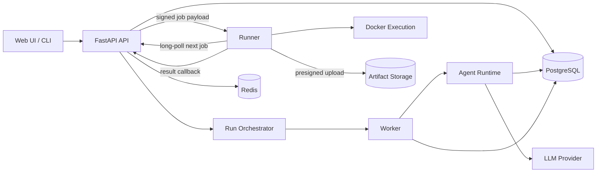
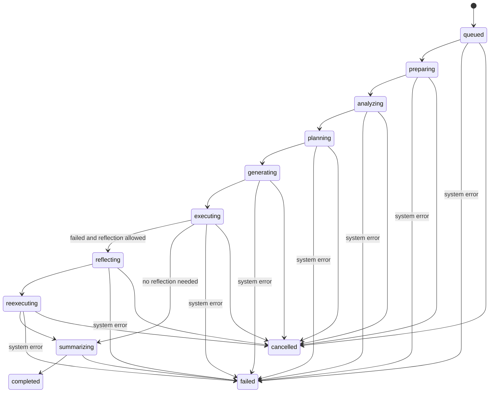
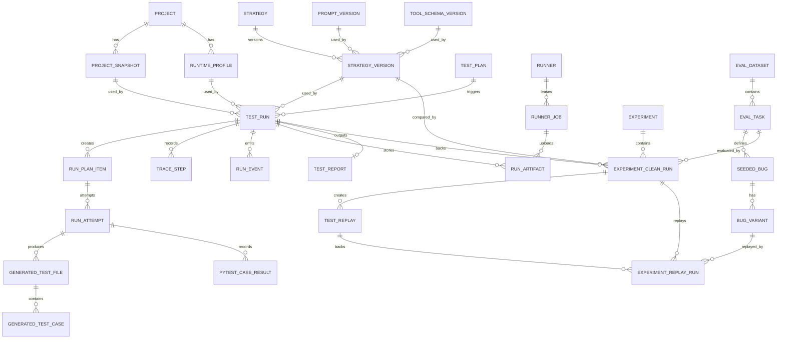

# TRACE 系统设计文档

## 1. 设计目标

TRACE 的系统设计只服务一件事：把 AI 生成测试从“模型输出文本”变成“可执行、可追踪、可评测的工程闭环”。

最终形态包含：

- control plane：项目、计划、策略、运行、报告、实验管理；
- execution plane：Runner、Docker、pytest、产物采集；
- agent plane：项目分析、测试规划、测试生成、失败反思；
- evaluation plane：数据集、种子 bug、策略对比和指标统计。

系统可以分阶段实现，但数据和接口设计要避免把未来堵死。

## 2. 总体架构



职责划分：

- API：参数校验、资源管理、查询接口，不执行耗时任务。
- Orchestrator：维护状态机，创建 Runner job，处理结果回调。
- Agent Runtime：只做分析、规划、生成和反思，不直接执行任意命令。
- Runner：主动向 API 拉取任务，准备工作目录、执行 pytest、采集 artifacts，通过 API 回传结果。
- PostgreSQL：主数据、过程数据、评测结果。
- Redis：队列、锁、短期状态。
- Artifact Storage：日志、JUnit XML、coverage、生成文件副本、报告导出。

远程 Runner 不允许直连 PostgreSQL，也不持有数据库凭证。它只能访问 Runner API 和预签名 artifact 上传地址。

## 3. 分阶段部署

### 3.1 V1 单机模式

- API、Worker、数据库、队列和本机 Runner 在同一台机器；
- Runner 可以先作为后端内部模块；
- 支持 examples 或白名单目录；
- 重点是端到端闭环、trace 和最小 seeded bug 评测；
- 至少包含 1 个 demo 项目、5-6 个 bug 变体、`seeded_bug_capture_rate` 和 `clean_false_positive_rate` 两个指标。
- V1 评测可以用固定目录和脚本实现，例如 `eval/demo/clean` 与 `eval/demo/variants/*`；不要求先落完整 `project_snapshots`、`bug_variants`、`test_replays` 和 `experiment_*` 表。

### 3.2 V2 评测模式

- 引入项目快照、运行配置和策略版本；
- 扩展为多项目 seeded bug 数据集；
- 支持同一测试在干净代码和 bug 变体之间重放；
- 正式落库 `bug_variants`、`test_replays`、`experiment_clean_runs` 和 `experiment_replay_runs`；
- 支持实验统计。

### 3.3 V3 平台模式

- Runner 抽成独立进程或服务；
- 支持 Runner 注册、心跳、标签、调度和 long-poll 领任务；
- Runner 通过鉴权 API 回传结果，通过预签名 URL 上传 artifacts；
- artifacts 可迁移到 MinIO/S3；
- 可接入更完整的 OpenTelemetry。

## 4. 核心模块

### 4.1 Project 模块

管理被测项目和项目快照。项目是业务容器，快照是运行复现基础。

### 4.2 Runtime Profile 模块

描述执行环境，包括 Python 版本、依赖安装、测试命令、环境变量和资源限制。运行必须绑定配置快照，不能只引用可变配置。

### 4.3 Strategy 模块

管理策略版本。策略版本必须不可变，绑定模型、Prompt、工具 Schema 和工作流配置。

### 4.4 Test Plan 模块

保存用户测试目标、范围、预算和策略选择。它描述“想测什么”，不保存 Agent 实际拆出来的任务。

### 4.5 Run Orchestrator 模块

创建测试运行，推进状态机，处理失败、重试、取消和幂等。

### 4.6 Agent 模块

通过工具分析项目、拆任务、生成测试、读取失败上下文并进行一次 Reflection。

### 4.7 Runner 模块

执行 pytest，解析结果，采集产物，回传结构化数据。Runner 不做业务决策。

### 4.8 Trace 与 Report 模块

Trace 保存过程，Report 保存结论。报告必须能链接到关键 trace step、测试结果和 artifacts。

### 4.9 Evaluation 模块

管理数据集、任务、种子 bug、bug 变体、实验运行和指标统计。

## 5. 运行生命周期、status 与 stage

`test_runs` 同时保存 `status` 和 `stage`：

- `status` 是外部状态，只用于表达运行是否排队、运行中、完成、失败或取消。
- `stage` 是内部阶段，只在 `status = running` 时表达当前执行到哪一步。

持久化取值：

| 生命周期节点    | `status`    | `stage`        |
| --------------- | ------------- | ---------------- |
| `queued`      | `queued`    | `null`         |
| `preparing`   | `running`   | `preparing`    |
| `analyzing`   | `running`   | `analyzing`    |
| `planning`    | `running`   | `planning`     |
| `generating`  | `running`   | `generating`   |
| `executing`   | `running`   | `executing`    |
| `reflecting`  | `running`   | `reflecting`   |
| `reexecuting` | `running`   | `reexecuting`  |
| `summarizing` | `running`   | `summarizing`  |
| `completed`   | `completed` | `null`         |
| `failed`      | `failed`    | 失败发生时的阶段 |
| `cancelled`   | `cancelled` | 取消发生时的阶段 |

下面的图是运行生命周期图，不是单独的 `status` 枚举图。



规则：

- `failed` 表示运行流程失败，不等于业务测试失败。
- pytest 有失败用例但系统正常产出报告时，运行可以是 `completed`，报告中标记测试失败。
- 任意活跃阶段遇到系统错误都进入 `failed`，例如依赖安装失败、项目分析失败、非法模型输出、Runner 超时或 artifact 上传失败。
- Reflection 只允许一次，因此没有 `reexecuting --> reflecting` 回边。
- 状态更新前必须先保存 `run_events` 和必要 `trace_steps`。
- 取消操作必须幂等。
- 用户触发 run 级 retry 时必须创建新 `test_run`，并通过 `retry_of_run_id` 指向原运行；同一 run 内只允许系统创建 `initial` 和最多一个 `reflection` attempt。

## 6. Agent 工具契约

工具返回必须结构化，不能只返回一坨日志文本。

### 6.1 `analyze_project`

输入：

```json
{
  "snapshot_id": "uuid",
  "target_scope": ["app/api", "app/services/user.py"]
}
```

输出：

```json
{
  "files": [
    {"path": "app/main.py", "kind": "source", "size": 1200}
  ],
  "routes": [
    {"method": "GET", "path": "/users/{id}", "handler": "get_user", "file": "app/api/users.py"}
  ],
  "functions": [
    {"name": "get_user", "signature": "get_user(user_id: int)", "file": "app/services/user.py"}
  ],
  "models": [
    {"name": "UserCreate", "file": "app/schemas/user.py"}
  ],
  "existing_tests": [
    {
      "path": "tests/test_users.py",
      "test_functions": [
        {"name": "test_get_user", "line": 12, "estimated_nodeid": "tests/test_users.py::test_get_user"}
      ]
    }
  ],
  "dependency_files": ["pyproject.toml", "requirements.txt"],
  "warnings": []
}
```

`estimated_nodeid` 来自静态 AST 估算，只能作为提示。若需要真实 pytest nodeid，必须单独运行 `pytest --collect-only` 或由 `run_pytest` 返回收集结果。

### 6.2 `write_test_file`

输入：

```json
{
  "attempt_id": "uuid",
  "path": "tests/generated/test_users_generated.py",
  "content": "pytest file content",
  "reason": "cover user query and 404 branch"
}
```

输出：

```json
{
  "file_id": "uuid",
  "path": "tests/generated/test_users_generated.py",
  "content_hash": "sha256",
  "bytes": 2300
}
```

约束：

- 路径必须在受控目录内；
- 禁止写业务源码；
- 工具层必须做 canonical path 校验。

### 6.3 `run_pytest`

输入：

```json
{
  "attempt_id": "uuid",
  "test_paths": ["tests/generated/test_users_generated.py"],
  "timeout_seconds": 120
}
```

输出：

```json
{
  "exit_code": 1,
  "collected": 5,
  "passed": 3,
  "failed": 2,
  "skipped": 0,
  "duration_ms": 8420,
  "case_results": [
    {
      "nodeid": "tests/generated/test_users_generated.py::test_get_user_404",
      "status": "failed",
      "duration_ms": 22,
      "message": "assert 200 == 404",
      "failure_type": "assertion"
    }
  ],
  "failures": [
    {
      "nodeid": "tests/generated/test_users_generated.py::test_get_user_404",
      "file": "tests/generated/test_users_generated.py",
      "line": 31,
      "exc_type": "AssertionError",
      "message": "assert 200 == 404",
      "traceback": "short traceback"
    }
  ],
  "artifacts": [
    {"type": "junit_xml", "uri": "artifacts/run.xml"}
  ],
  "error": null
}
```

失败日志已经在 `failures` 中，不单独设计 `read_test_log`。

### 6.4 `search_code` 和 `read_file`

这两个工具只提供必要上下文：

- `read_file` 必须限制最大文件大小和路径范围；
- `search_code` 返回命中摘要和行号，不返回整个仓库；
- 工具调用输入输出都要写入 trace step。

## 7. Reflection 设计

Reflection 输入：

- 首轮生成测试文件；
- `run_pytest` 结构化失败结果；
- 相关源码上下文；
- 项目分析摘要；
- Reflection 契约。

Reflection 输出：

- 修复后的测试文件；
- 修复原因；
- 修改点摘要；
- 是否降低断言强度；
- 是否判定疑似业务缺陷。

禁止行为：

- 修改业务源码；
- 删除核心断言；
- 使用空洞断言；
- 使用 `pytest.skip` 掩盖失败；
- 为了通过而接受明显错误行为。

如果修复需要削弱断言，必须停止修复并标记 `suspected_code_bug`。

## 8. Runner 与 Docker 边界

Docker 是隔离层之一，不是绝对安全保证。

阶段口径：

- V1 可以使用后端内部 Runner，以白名单目录、独立 subprocess、硬超时和最小路径校验跑通闭环。
- V2 引入 Docker 执行，保证执行结果和 artifacts 的结构化采集。
- V3 才实现远程/自托管 Runner 协议，并完成容器加固。

Runner 必须做到：

- 每次运行使用独立工作目录；
- 源码只读挂载，生成测试目录可写；
- 容器内使用非 root 用户；
- 禁止 privileged；
- 禁止挂载 Docker socket；
- drop 不必要 capabilities；
- 配置 seccomp 或 AppArmor；
- 限制 CPU、内存、进程数和超时；
- 默认禁网；
- secrets 和环境变量脱敏；
- 容器退出后只保留必要 artifacts。

依赖安装和禁网存在冲突，必须选择明确方案：

- 使用预构建镜像；
- 使用离线 wheelhouse；
- 使用受控代理；
- 或将依赖安装阶段与测试执行阶段拆开，并记录网络策略。

### 8.1 V3 Runner 协议

自托管 Runner 通常在 NAT 或防火墙后，后端不能假设能主动推送任务。Runner 协议采用“Runner 主动拉取”的模型，类似 CI runner。

核心流程：

1. Runner 启动后调用 `POST /api/v1/runners/register` 注册，获得 `runner_id` 和短期 token。
2. Runner 定期调用 `POST /api/v1/runners/{runner_id}/heartbeat` 上报状态、标签、容量和当前任务。
3. Runner 通过 `GET /api/v1/runners/{runner_id}/next-job` long-poll 领任务。
4. API 返回签名后的 job payload、输入 artifact 下载地址和输出 artifact 预签名上传地址。
5. Runner 执行任务，期间可调用 `POST /api/v1/runner-jobs/{job_id}/events` 上报阶段事件。
6. Runner 上传 artifacts 到预签名 URL。
7. Runner 调用 `POST /api/v1/runner-jobs/{job_id}/result` 回传结构化结果。
8. 后端校验 job lease、artifact hash 和结果 Schema，然后更新 run/attempt 状态。

协议约束：

- Runner 不直连数据库，不持有 DB 凭证。
- Runner 只通过鉴权 API 领取任务和回传结果。
- job payload 必须包含 `job_id`、`run_id`、`attempt_id`、`snapshot_ref`、`runtime_snapshot`、`test_paths`、`timeout_seconds`、`artifact_uploads` 和 `lease_expires_at`。
- 每个 job 必须有租约，Runner 超时未续约则任务回到可重试状态。
- 结果回传必须幂等，重复回传同一 `job_id` 只能更新同一结果，不能创建新 attempt。
- artifacts 先上传，再回传结果中的 artifact metadata。

## 9. 数据模型

### 9.1 关系概览



### 9.2 核心表

#### `projects`

项目元数据。

关键字段：

- `id`
- `name`
- `description`
- `source_type`
- `repo_url`
- `local_path`
- `default_branch`
- `language`
- `framework`
- `status`

#### `project_snapshots`

不可变项目版本。

关键字段：

- `id`
- `project_id`
- `source_kind`
- `source_ref`
- `commit_sha`
- `content_hash`
- `root_path`
- `dependency_summary`
- `entrypoint_guess`
- `analysis_summary`
- `created_at`

#### `runtime_profiles`

执行配置。运行时必须复制一份快照到 `test_runs.runtime_snapshot`。

关键字段：

- `id`
- `project_id`
- `name`
- `python_version`
- `install_command`
- `test_command`
- `env_template`
- `resource_limits`
- `network_policy`

#### `strategies` 和 `strategy_versions`

`strategies` 是逻辑名称，`strategy_versions` 是不可变执行版本。

`strategy_versions` 关键字段：

- `id`
- `strategy_id`
- `version`
- `workflow_type`
- `model_provider`
- `model_name`
- `model_params`
- `prompt_version_id`
- `tool_schema_version_id`
- `max_tool_calls`
- `allow_reflection`
- `temperature`
- `is_locked`

可复现规则：

- `prompt_version_id` 必须指向不可变 prompt 正文，不能只存 `auth_v3` 这类字符串。
- `tool_schema_version_id` 必须指向不可变工具 Schema 正文。
- 创建 `test_runs` 时，应把已解析的 prompt、工具 Schema、模型参数复制进 `strategy_snapshot`，历史 run 不依赖可变配置。

#### `prompt_versions`

不可变 Prompt 版本。

关键字段：

- `id`
- `name`
- `version`
- `content`
- `content_hash`
- `source_ref`
- `created_at`

`source_ref` 可指向仓库路径和 commit，例如 `prompts/auth.md@abc123`。即使 prompt 在仓库中版本化，数据库或 artifact 中也必须能通过 `content_hash` 找回当时正文。

#### `tool_schema_versions`

不可变工具 Schema 版本。

关键字段：

- `id`
- `version`
- `schema_json`
- `content_hash`
- `created_at`

工具输入输出契约一旦参与运行，不允许原地修改。

#### `test_plans`

用户输入的测试目标。测试计划可以保存默认策略，但策略不在计划级固化。

关键字段：

- `id`
- `project_id`
- `name`
- `target_scope`
- `goal`
- `budget`
- `output_options`
- `default_strategy_version_id`
- `status`

注意：Agent 实际拆出来的任务不放这里，放 `run_plan_items`。

策略归属规则：`default_strategy_version_id` 只是默认值。实验和单次运行可以覆盖该默认值，最终用于执行和复现的是 `test_runs.strategy_version_id` 与 `test_runs.strategy_snapshot`。

#### `test_runs`

一次完整运行。策略、模型参数、Prompt、工具 Schema 和运行配置在 run 级固化。

关键字段：

- `id`
- `test_plan_id`
- `retry_of_run_id`
- `project_snapshot_id`
- `runtime_profile_id`
- `strategy_version_id`
- `runtime_snapshot`
- `strategy_snapshot`
- `status`
- `stage`
- `started_at`
- `finished_at`
- `total_tokens`
- `total_cost`
- `tool_call_count`
- `pytest_summary`
- `error_code`
- `error_message`

`retry_of_run_id` 只用于用户触发的 run 级重试。重试创建新 run，不覆盖旧 run，也不在旧 run 下追加重试 attempt。

#### `run_plan_items`

某次运行中 Agent 拆出的任务。

关键字段：

- `id`
- `run_id`
- `index`
- `target_type`
- `target_ref`
- `goal`
- `planned_assertions`
- `status`

#### `run_attempts`

一次生成和执行尝试。

关键字段：

- `id`
- `run_plan_item_id`
- `attempt_no`
- `kind`
- `status`
- `started_at`
- `finished_at`
- `pytest_exit_code`
- `error_code`
- `reflection_reason`

`kind` 可取 `initial`、`reflection`。每个 `run_plan_item` 最多一个 `initial` attempt 和一个 `reflection` attempt。

#### `generated_test_files`

生成测试文件版本。

关键字段：

- `id`
- `attempt_id`
- `path`
- `content_text`
- `content_hash`
- `artifact_id`
- `previous_file_id`
- `diff_artifact_id`
- `generation_reason`

`content_text` 可为空。文件正文可以短期保存在数据库，长期主存储应是 artifact。

#### `generated_test_cases`

文件中的测试用例逻辑单元。

关键字段：

- `id`
- `file_id`
- `nodeid`
- `test_name`
- `start_line`
- `end_line`
- `target_route`
- `target_function`
- `assertion_summary`
- `source_strategy_version_id`
- `adoption_status`
- `human_meaningfulness_score`
- `rule_flags`

这是采纳、人工评分和有效性分析的基本粒度。

`human_meaningfulness_score` 来自人工 1/3/5 量规。`rule_flags` 只存规则预筛结果，例如 `only_status_200`、`no_body_assertion`、`uses_broad_exception`，不能替代人工评分。

#### `pytest_case_results`

pytest 单用例结果。

关键字段：

- `id`
- `attempt_id`
- `generated_test_case_id`
- `nodeid`
- `mapping_status`
- `status`
- `duration_ms`
- `failure_type`
- `failure_message`
- `traceback_hash`
- `stdout_excerpt`
- `stderr_excerpt`

没有这张表，bug 捕获率、假阳性和 flaky 分析都不可信。

用例映射策略：

- 生成测试文件后，系统先用 AST 解析函数和类，登记 `generated_test_cases`，记录 `test_name`、文件路径、起止行和父级结构。
- pytest 收集后，以 `nodeid`、文件路径和函数名对齐 `generated_test_cases`。
- 参数化测试如 `test_x[a]`、`test_x[b]` 归并到同一个父用例 `test_x`，`pytest_case_results.nodeid` 保留完整参数化 nodeid。
- 如果 pytest 收集到的 nodeid 无法映射，`generated_test_case_id` 允许为空，并标记 `mapping_status = unmatched`。
- 如果一个生成函数展开出多个参数化 case，捕获率按 pytest case result 判断，人工采纳和有效性评分按父级 generated test case 判断。

#### `trace_steps`

Agent 和系统过程事件。

关键字段：

- `id`
- `run_id`
- `attempt_id`
- `step_index`
- `step_type`
- `name`
- `input_summary`
- `output_summary`
- `tool_name`
- `payload`
- `tokens`
- `duration_ms`
- `status`
- `error`

`step_type` 可取 `plan`、`tool_call`、`observation`、`generation`、`reflection`、`report`、`system`。

#### `run_events`

状态机和系统事件。

关键字段：

- `id`
- `run_id`
- `stage`
- `event_type`
- `status_before`
- `status_after`
- `message`
- `created_at`

用于排查状态错乱，不能只靠 trace。

#### `run_artifacts`

产物元数据。

关键字段：

- `id`
- `run_id`
- `attempt_id`
- `runner_job_id`
- `artifact_type`
- `uri`
- `content_hash`
- `size_bytes`
- `metadata`

#### `test_reports`

最终报告。

关键字段：

- `id`
- `run_id`
- `summary`
- `metrics`
- `risk_notes`
- `markdown_artifact_id`
- `json_artifact_id`

### 9.3 评测表

#### `eval_datasets`

评测数据集版本。

关键字段：

- `id`
- `name`
- `version`
- `description`
- `project_snapshot_ids`

#### `eval_tasks`

评测任务。

关键字段：

- `id`
- `dataset_id`
- `project_snapshot_id`
- `target_scope`
- `goal`
- `expected_capabilities`

#### `seeded_bugs`

缺陷定义。

关键字段：

- `id`
- `eval_task_id`
- `bug_type`
- `description`
- `expected_detection`

#### `bug_variants`

具体缺陷变体。

关键字段：

- `id`
- `seeded_bug_id`
- `variant_name`
- `canonical_kind`
- `patch_artifact_id`
- `mutated_snapshot_id`
- `ground_truth`

canonical 规则：

- 推荐以 `patch_artifact_id` 作为 canonical source，表示从干净快照应用补丁得到 bug 变体。
- `mutated_snapshot_id` 只能作为派生产物缓存，由 `patch_artifact_id + base_snapshot_id` 生成。
- 如果选择预生成快照作为 canonical，则必须把 `canonical_kind` 设为 `snapshot`，并禁止同一变体再维护独立 patch，避免两套表示漂移。

#### `experiments`

实验定义。

关键字段：

- `id`
- `name`
- `dataset_id`
- `strategy_version_ids`
- `repeat_count`
- `temperature_policy`
- `created_at`

实现时建议用 `experiment_strategy_versions` 关联表保存实验包含的策略版本。文档中的 `strategy_version_ids` 只是蓝图简写，避免把多对多关系硬塞进数组字段。

#### `experiment_clean_runs`

实验中在干净代码上的生成运行。假阳性属于这一层。

关键字段：

- `id`
- `experiment_id`
- `eval_task_id`
- `strategy_version_id`
- `repeat_index`
- `clean_run_id`
- `generated_test_set_artifact_id`
- `false_positive`
- `clean_metrics`

#### `test_replays`

重放执行记录。重放不规划、不生成、不调用 LLM，只把已生成测试集跑到指定快照上。

关键字段：

- `id`
- `experiment_clean_run_id`
- `generated_test_set_artifact_id`
- `target_snapshot_id`
- `bug_variant_id`
- `status`
- `pytest_summary`
- `started_at`
- `finished_at`
- `error_code`

`experiment_clean_run_id` 指向 `experiment_clean_runs.id`，不是 `test_runs.id`。重放使用 `experiment_clean_runs.generated_test_set_artifact_id` 冻结下来的最终测试集；`generated_test_set_artifact_id` 在这里冗余保存一份，便于独立审计。

`test_replays` 不需要 `strategy_version_id`。它继承对应 clean run 的生成测试集，策略只用于解释测试从哪里来。

#### `experiment_replay_runs`

实验中的 bug 变体重放结果。捕获率属于这一层。

关键字段：

- `id`
- `experiment_clean_run_id`
- `bug_variant_id`
- `replay_id`
- `captured_bug`
- `replay_metrics`

设计规则：

- clean run 负责生成并在干净代码上验证测试；
- replay 负责把同一批最终测试跑到 bug variant；
- `false_positive` 只存于 `experiment_clean_runs`，不在每个 bug 变体行重复；
- `captured_bug` 只存于 `experiment_replay_runs`；
- 不允许 Agent 在 bug variant 上重新生成测试。

评测运行会为每个 `eval_task` 合成或引用一个 `test_plan`，但捕获率分母以 `eval_task.target_scope` 为准。`test_plan.target_scope` 应与其保持一致，不能作为第二个分母来源。

### 9.4 Runner 表

#### `runners`

执行节点。

关键字段：

- `id`
- `name`
- `mode`
- `labels`
- `status`
- `last_heartbeat_at`
- `capabilities`

V1 可不建表，但 V3 需要。

#### `runner_jobs`

远程 Runner 领取的执行任务。

关键字段：

- `id`
- `runner_id`
- `run_id`
- `attempt_id`
- `job_type`
- `status`
- `lease_expires_at`
- `payload_hash`
- `result_hash`
- `created_at`
- `finished_at`

V3 才需要。`runner_jobs` 是 API 与 Runner 协议的持久化边界，Runner 结果回传必须以 `job_id` 幂等落库。

## 10. API 设计

### 10.1 项目与快照

- `POST /api/v1/projects`
- `GET /api/v1/projects`
- `GET /api/v1/projects/{project_id}`
- `POST /api/v1/projects/{project_id}/snapshots`
- `GET /api/v1/projects/{project_id}/snapshots`

### 10.2 计划与运行

- `POST /api/v1/test-plans`
- `GET /api/v1/test-plans/{plan_id}`
- `POST /api/v1/test-plans/{plan_id}/runs`
- `GET /api/v1/test-runs/{run_id}`
- `POST /api/v1/test-runs/{run_id}/cancel`
- `POST /api/v1/test-runs/{run_id}/retry`

`POST /api/v1/test-plans/{plan_id}/runs` 请求体必须显式支持覆盖计划默认值：

```json
{
  "snapshot_id": "uuid",
  "runtime_profile_id": "uuid",
  "strategy_version_id": "uuid",
  "budget_override": {
    "max_tool_calls": 12,
    "timeout_seconds": 300,
    "allow_reflection": true
  },
  "output_options": {
    "collect_coverage": false,
    "save_full_trace": true
  }
}
```

其中 `strategy_version_id` 是 run 级最终策略；如果省略，才使用 `test_plans.default_strategy_version_id`。

`POST /api/v1/test-runs/{run_id}/retry` 必须创建一个新的 `test_run`，新 run 的 `retry_of_run_id` 指向原 run，并返回 `new_run_id`。它不能在原 run 下追加重试 attempt。

### 10.3 结果查询

- `GET /api/v1/test-runs/{run_id}/trace-steps`
- `GET /api/v1/test-runs/{run_id}/events`
- `GET /api/v1/test-runs/{run_id}/attempts`
- `GET /api/v1/test-runs/{run_id}/pytest-results`
- `GET /api/v1/test-runs/{run_id}/artifacts`
- `GET /api/v1/test-runs/{run_id}/report`
- `PATCH /api/v1/generated-test-cases/{case_id}/adoption`

### 10.4 策略与评测

- `POST /api/v1/strategies`
- `POST /api/v1/strategies/{strategy_id}/versions`
- `GET /api/v1/strategy-versions/{version_id}`
- `POST /api/v1/prompt-versions`
- `GET /api/v1/prompt-versions/{prompt_version_id}`
- `POST /api/v1/tool-schema-versions`
- `GET /api/v1/tool-schema-versions/{tool_schema_version_id}`
- `POST /api/v1/eval-datasets`
- `POST /api/v1/experiments`
- `GET /api/v1/experiments/{experiment_id}`
- `POST /api/v1/experiments/{experiment_id}/runs`
- `GET /api/v1/experiments/{experiment_id}/metrics`

### 10.5 Runner

- `POST /api/v1/runners/register`
- `POST /api/v1/runners/{runner_id}/heartbeat`
- `GET /api/v1/runners/{runner_id}/next-job`
- `POST /api/v1/runner-jobs/{job_id}/events`
- `POST /api/v1/runner-jobs/{job_id}/result`
- `GET /api/v1/runners`

V1 可以不开放 Runner API。

## 11. 评测指标

### 11.1 核心定义

`seeded_bug_capture_rate`：

```text
captured_in_scope_bug_variants / total_in_scope_bug_variants
```

一个 bug variant 被捕获，必须满足：

- 重放的是 Reflection 后在干净代码上最终通过的测试集；
- 至少一个测试在干净代码上通过；
- 同一测试在 bug variant 上发生 assertion failure；
- 失败原因与 seeded bug 的 ground truth 相关；
- 失败不是 import、collection、fixture、环境错误或运行时 error。

分母只包含本次 `eval_task.target_scope` 覆盖范围内的 bug variant。范围外 bug 不计入该评测任务的捕获率。评测流程中如果合成了 `test_plan`，它的 `target_scope` 必须来自 `eval_task.target_scope`，不能另起一套范围。

`clean_false_positive_rate`：

```text
clean_failed_runs / clean_total_runs
```

`reflection_valid_fix_rate`：

```text
valid_reflection_fixes / reflection_attempts
```

有效修复必须修测试自身问题，不能删除断言、跳过测试或降低核心断言强度。

更精确地说，一个有效 Reflection fix 必须同时满足：

- 修复后测试在干净代码上通过；
- 修改原因属于 import、fixture、调用签名、测试数据或断言方向等测试自身问题；
- 没有删除核心断言；
- 没有把具体断言改成空洞断言；
- 没有使用 `pytest.skip`、条件跳过或宽泛异常吞掉失败。

`meaningful_assertion_rate`：

```text
generated_test_cases_with_human_meaningfulness_score_gte_3 / valid_generated_test_cases
```

`valid_generated_test_cases` 指在干净代码最终测试集中被 pytest 成功收集、至少映射到一个 `pytest_case_results`，且失败类型不是 import、collection、fixture 或环境错误的父级 generated test case。参数化测试的多个 pytest case result 归并到同一个父级 generated test case。

人工评分量规见 11.3，本节只定义公式。

`cost_per_captured_bug`：

```text
total_cost / captured_in_scope_bug_variants
```

如果 `captured_in_scope_bug_variants = 0`，该指标记为无穷大或单独标记 `no_bug_captured`，不要用 0 伪装成本。

### 11.2 辅助指标

- pytest 收集成功率；
- 测试生成成功率；
- 首轮通过率；
- 修复后通过率；
- 平均 token；
- 平均工具调用次数；
- 平均耗时；
- flaky 比例；
- 人工有效性评分；
- 覆盖率变化。

覆盖率不能作为头号指标。

### 11.3 人工评分量规

- 5 分：覆盖核心路径和边界，断言有业务意义，能抓回归。
- 3 分：能运行，断言基本合理，但边界不足或断言偏弱。
- 1 分：能运行但断言空洞，或者目标错位。

至少两人评分时取均值，并记录评分人和时间。

## 12. 可靠性设计

### 12.1 幂等

- 每个阶段开始前检查当前状态；
- artifacts 使用内容 hash 或唯一 key；
- 重试创建新 attempt；
- 策略版本和运行配置快照不可变。

### 12.2 错误分类

建议错误码：

- `INVALID_MODEL_OUTPUT`
- `TOOL_ARGUMENT_ERROR`
- `PROJECT_ANALYSIS_FAILED`
- `DEPENDENCY_INSTALL_FAILED`
- `PYTEST_COLLECTION_FAILED`
- `PYTEST_EXECUTION_FAILED`
- `RUNNER_TIMEOUT`
- `RUNNER_INTERNAL_ERROR`
- `REFLECTION_CONTRACT_VIOLATION`
- `ARTIFACT_UPLOAD_FAILED`
- `LLM_PROVIDER_ERROR`（上游 LLM API 调用失败：网络抖动 / 429 限流 / 5xx / 鉴权；瞬态错误已退避重试，仍失败才落此码）

### 12.3 状态写入顺序

1. 保存 trace step 或 run event。
2. 保存 artifacts 元数据。
3. 保存结构化结果。
4. 更新 run 或 attempt 状态。

不要反过来。否则失败时会出现“状态变了但过程丢了”的黑盒。

## 13. 可观测性设计

日志字段：

- `run_id`
- `attempt_id`
- `stage`
- `event_type`
- `status`
- `duration_ms`
- `strategy_version_id`
- `runner_id`
- `error_code`

核心指标：

- API 响应耗时；
- 队列长度；
- Worker 成功率；
- Runner 成功率；
- 阶段耗时；
- LLM token；
- pytest 收集失败率；
- Reflection 契约违规次数。

Trace 用于产品回放，日志用于运维排错，两者不要混成一张大杂烩。

## 14. 技术选型

推荐栈：

| 分层   | 技术                                                               |
| ------ | ------------------------------------------------------------------ |
| 前端   | Vue 3 + TypeScript + Vite                                          |
| UI     | Element Plus 或 Naive UI                                           |
| 后端   | FastAPI + Pydantic v2                                              |
| ORM    | SQLAlchemy 2.x + Alembic                                           |
| 数据库 | PostgreSQL                                                         |
| 队列   | Redis + Celery 或 RQ                                               |
| 执行   | V1 内部 Runner/subprocess + pytest，V2/V3 Runner + Docker + pytest |
| 产物   | 本地文件系统，后续 MinIO/S3                                        |
| Agent  | 自定义状态机 + Pydantic 工具 Schema                                |
| 观测   | 结构化日志，后续 OpenTelemetry                                     |

不建议第一层就绑定重型 Agent 框架。TRACE 的复杂度在业务状态、执行反馈和评测，不在多轮聊天框架。

## 15. 代码组织建议

```text
backend/
  app/
    api/
    agents/
    core/
    db/
    models/
    schemas/
    services/
    tools/
    runners/
    workers/
frontend/
  src/
examples/
eval/
docs/
artifacts/
```

模块边界：

- `agents/` 只处理 Agent 工作流和策略；
- `tools/` 封装 Agent 可调用工具；
- `runners/` 处理执行环境和 pytest；
- `services/` 处理业务规则；
- `models/` 和 `schemas/` 分别对应数据库和 API/工具结构；
- `eval/` 存放数据集、bug 变体和评测脚本。

## 16. 结论

最终形态下，TRACE 不是一个会写 pytest 的脚本，而是一个围绕测试生成建立的 Agent 工程系统。系统设计的硬点有四个：

1. 数据模型必须支撑用例级结果和实验复现。
2. 工具契约必须结构化，尤其是 `analyze_project` 和 `run_pytest`。
3. Reflection 必须有红线，不能为了通过而废掉测试。
4. 评测必须以 seeded bug 捕获率为核心，不能被覆盖率和通过率带偏。
